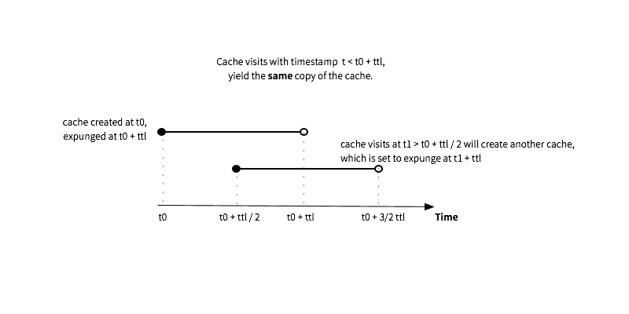

# HLCache (Half-life cache)
This is a variant of Clock cache algorithm that keeps a ghost copy for an extended period of time. It could be useful for implementing shared session cache.

# Install
```bash
$ npm install hl-cache
```

# API
* `new HLCache([options])`
	Create a cache pool.

```js
var cache = new HLCache({
	 // maximum size of the cache
	max: 2000,
	 // cache entry time-to-live in milliseconds
	lifespan: 2000
});
```

	If the number of items in the cache pool exceeds `max`, the item will not be store in the cache.

- `HLCache::get(key[, timestamp])`
	Get the value by `key`. `timestamp` is optional, it is used to indicate the time the visit comes from. If no value is provided, `timestamp` is set to `Date.now()`.

- `HLCache::set(key, value[, timestamp])`
	Set the value of `key` to `value`. `timestamp` is optional, it is used to indicate the time the visit comes from. If no value is provided, `timestamp` is set to `Date.now()`.

- `HLCache::has(key)`
	Check if a key is in the cache.

- `length`
	Return total length of objects in cache.

# Half-life cache algorithm


Half-life cache could (almost) guarantees consistent read in cache’s lifespan, which could be useful for implementing shared session cache.


# License

Copyright (c) 2015 Jingwei "John" Liu

Licensed under the MIT license.

